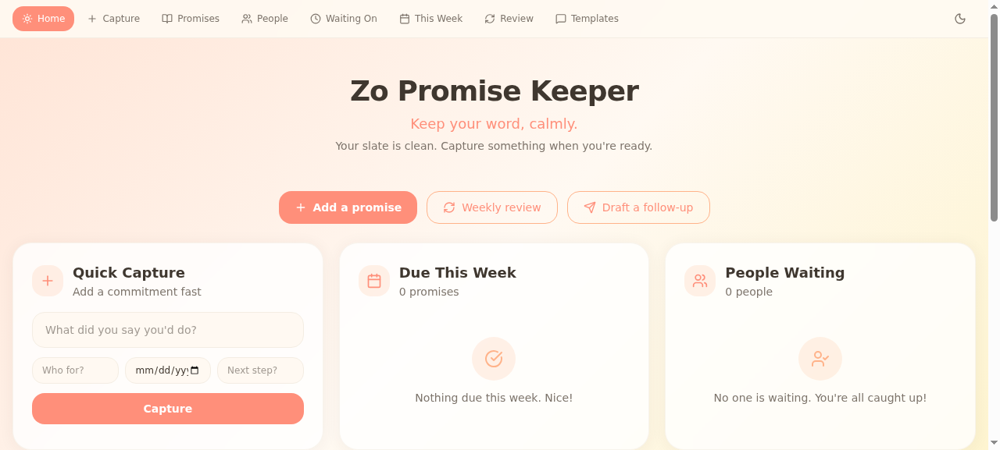
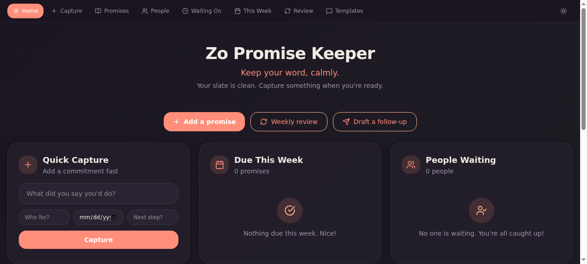

# ☀️ Zo Promise Keeper

**Keep your word, calmly.**

A warm, sunrise-toned personal accountability Space for [Zo Computer](https://zocomputer.com). Track every promise, reply, and commitment you want to keep — without guilt-heavy energy.




---

## Features

- **Quick Capture** — Add a commitment in under 20 seconds
- **Promises Database** — Full CRUD with filtering (All Open, Due This Week, Overdue, Quick Wins, etc.)
- **People Database** — Relationship cards with warmth levels and follow-up tracking
- **Waiting On View** — Split view: what's waiting on you vs what's blocked by others
- **This Week Board** — Tactical weekly view with "One promise to close today" spotlight
- **Weekly Review** — Guided review prompts with stats dashboard
- **Message Templates** — 6 pre-written warm accountability messages (copy to clipboard)
- **Zo Prompts** — 7 saved prompts for extracting commitments and drafting follow-ups
- **Light / Dark Mode** — Toggle with localStorage persistence

## Promise Categories

Promises · Follow-ups · Replies · Favors · Errands · Things to send · Things to schedule · Check-ins · Life admin

## Design

- Soft cream background with sunrise gradient accents
- Rounded dashboard cards with glass-morphism
- Peach, coral, yellow, mint, and cloud-blue highlights
- Dark mode: deep purple-tinted background with warm coral accents
- Emotionally safe — encouraging, airy, polished

---

## Install on Zo Computer

### Option 1: Quick Install (recommended)

1. Clone this repo into your Zo workspace:
   ```bash
   cd /home/workspace
   git clone https://github.com/KaiyzerBX50/zo-promise-keeper.git
   ```

2. Create the data directory:
   ```bash
   mkdir -p /home/workspace/promise-keeper-data
   echo '{"promises":[],"people":[],"nextPromiseId":1,"nextPersonId":1}' > /home/workspace/promise-keeper-data/promises.json
   ```

3. Tell Zo in chat:
   > Install Zo Promise Keeper. Create an API route at `/api/promise-keeper` using the code from `zo-promise-keeper/routes/api-promise-keeper.ts`, and a page route at `/promise-keeper` using the code from `zo-promise-keeper/routes/page-promise-keeper.tsx`.

4. Visit `https://<your-handle>.zo.space/promise-keeper`

### Option 2: Manual Install

1. In Zo Space, create a new **API route** at `/api/promise-keeper`
   - Copy the contents of `routes/api-promise-keeper.ts`

2. Create a new **Page route** at `/promise-keeper`
   - Copy the contents of `routes/page-promise-keeper.tsx`

3. Create the data directory:
   ```bash
   mkdir -p /home/workspace/promise-keeper-data
   echo '{"promises":[],"people":[],"nextPromiseId":1,"nextPersonId":1}' > /home/workspace/promise-keeper-data/promises.json
   ```

4. Done! Visit your page.

---

## Architecture

```
zo-promise-keeper/
├── README.md                          # This file
├── LICENSE                            # MIT License
├── routes/
│   ├── api-promise-keeper.ts          # Hono API route (CRUD for promises & people)
│   └── page-promise-keeper.tsx        # React page route (full UI)
├── data/
│   └── promises.json                  # Starter data template
└── scripts/
    ├── install.sh                     # Guided install helper
    └── deploy.sh                      # Auto-deploy script
```

### Tech Stack

- **Runtime:** Zo Space (Bun + Hono server)
- **Frontend:** React with Tailwind CSS 4
- **Icons:** lucide-react
- **Storage:** JSON file at `/home/workspace/promise-keeper-data/promises.json`
- **No external APIs** — fully self-contained, no `/zo/ask`, no credits consumed

### Data Model

**Promises:**
| Field | Type | Description |
|-------|------|-------------|
| id | number | Auto-incrementing ID |
| promise | string | What you said you'd do |
| personName | string | Who it's for |
| category | string | Reply, Send, Do, Schedule, Buy, Check In, Deliver, Personal, Life Admin |
| dueDate | string | When it's due |
| status | string | Inbox, Planned, On Track, Due Soon, Needs Attention, Waiting on Someone, Done, Dropped |
| priority | string | Low, Normal, Important, High |
| emotionalWeight | string | Light, Medium, Heavy |
| nextAction | string | The first/next step |
| notes | string | Additional context |

**People:**
| Field | Type | Description |
|-------|------|-------------|
| id | number | Auto-incrementing ID |
| name | string | Person's name |
| relationshipType | string | Friend, Family, Partner, Mentor, Client, Coworker, Collaborator, Other |
| warmth | string | Cold, Steady, Warm, Close |
| needsFollowUp | boolean | Flag for follow-up |
| preferredComm | string | How they prefer to communicate |

---

## What This Is Not

- ❌ A project management tool
- ❌ A hustle-productivity app
- ❌ A punitive habit system

This is a **personal reliability system** — warm, clear, and emotionally safe.

---

## Credits

Built by [dagawdnyc](https://dagawdnyc.zo.space) on [Zo Computer](https://zocomputer.com).

## License

MIT
